# Projet d'Infrastructure Web
## InfraWeb NovaTech - Intranet WordPress sécurisé avec LDAP & NGINX

Ce projet met en place une infrastructure **Web complète** et **sécurisée** pour l’entreprise fictive **NovaTech**.
Il simule un **environnement** **professionnel** et couvre l’ensemble des briques nécessaires à un **Intranet** moderne :

## Objectif du projet

Mettre en place, configurer et sécuriser un **intranet** d’entreprise nommé **Intranet NovaTech**, basé sur un environnement Linux Ubuntu Server 22.04, conforme aux standards d’une infrastructure professionnelle.

Cet intranet doit être accessible en HTTPS, authentifié via un annuaire LDAP interne, et protégé par un reverse proxy NGINX agissant comme point d’entrée sécurisé du système.

L’objectif est de constituer un lab complet d’Administration Système, Réseau et Cybersécurité, intégrant :
- Un serveur **LAMP** (Linux + Apache + MariaDB + PHP)
- Un **WordPress** d’entreprise (Intranet NovaTech)
- Un annuaire **LDAP** pour la gestion centralisée des identités
- Un Reverse Proxy **NGINX** en frontal
- Une configuration **HTTPS** (TLS complet)
- Un **durcissement** de l’infrastructure (UFW, Fail2ban, permissions, best practices)

---

**Nomenclature** Etabli : 

- Nom de l'entreprise : **NovaTech**
- Nom du site WP choisi : **Intranet NovaTech**
- Nom domaine choisi : `intranet.novatech.local`
- Apache Backend : sur `port 8080`
- Nginx Frontend : sur `port 443`
- Nom Base de donnée mariadb : `wordpress_labs_2025`
- User MariaDB : `wpadmin_labs_2025`
- User WordPress `adminlabs2025`
- User LDAP : `admin`
- User server Administration serveur : `admin`
- Emplacement WordPress : `/var/www/wordpress`

Architecture entreprise - utilisateur test : 
- Jean Duponts - `employees`
- Marie Lefevre - `Managers` 


Le tout dans un environnement reproductible, cohérent, et sécurisé, comme en production.

*Note : Ce projet ne s'inscrit pas dans la formation, projet personnel supplémentaire pour manipuler les infrastructures webs*


---
## Sommaire
1. [Objectif du Projet](#objectif-du-projet)
1. [Préparation environnement LAB Serveur](#préparation-environnement-lab-serveur)
2. [Installation de la stack LAMP](#installation-de-la-stack-lamp)
    1. [Installation Apache2](#installation-apache2)
    2. [Installation Mariadb](#installation-mariadb)
    3. [Installation PHP et extensions Wordpress](#installation-php-et-extensions-wordpress)
    4. [Préparation de la base MariaDB pour Wordpress](#preparation-de-la-basemariadb-pour-wordpress)
    5. [Télécharger Wordpress](#télécharger-wordpress)
3. [Configuration du VirttalHost Apache](#configuration-du-virtualhost-apache)
5. [Installation de Wordpress](#installation-de-wordpress)
6. [Installation et Configuration de LDAP](#installation-et-configuration-de-ldap)
7. [Lié LDAP à WordPress](#lié-ldap-à-wordpress)
8. [Génération du Certificat TLS](#génération-du-certificat-tls)
9. [Installation & Configuration NGINX](#installation--configuration-nginx)
10. [Test Hote](#test-hote)
11. [Test sur la vm-entreprise de Mr Jdupont](#test-sur-la-vm-entreprise-de-mr-jdupont)
12. [Durcicement de sécurité avec Fail2ban](#durcicement-de-sécurité-avec-fail2ban)
13. [Conclusion du projet ](#conclusion-du-projet)
---

## Préparation environnement LAB Serveur

Pour la réalisations du Projet, on utilise un environnement sous **VirutalBox** avec une virtualision du **Serveur** avec Ubuntu-serveur en 22.04 avec 2 intefaces réseaux, sous **NatNetwork** et **HostsOnly** pour le lab

Puis on mettra en place une **vm-test** d'un utilisateur de l'entreprise pour simuler son environnement et son acces au serveur web 


Environnements Labs sous VirtualBox avec :

1. Serveur : `vm-server` 
    - Réseaux **NatNetwork** sous `10.0.2.0/24` simulation réseau entreprise
    - Réseaux **Hots-only** sous `192.168.56.0/24` pour Administration
    - OS : ubuntu-server 22.04

### 1. Mettre à jours le Systeme 
```bash
sudo apt update && sudo apt upgrade -y
sudo apt autoremove -y
```

### 1.2. Mettre a jours la configuration réseau avec `.yaml`
1. Interface **enp0s3** :
    - `10.0.2.4/24`
2. Interface **enp0s8** :
    - `192.168.56.2/24`

Nous allons diter le fichier de configuration réseau : `/etc/netplan/00-installer-config.yaml`

```bash
network:
    version: 2
    ethernets:
        enp0s3:
            dhcp4: no
            addresses: [10.0.2.4/24]
            gateway4: 10.0.2.1
            nameservers:
                addresses: [8.8.8.8,8.8.4.4]
        enp0s8:
            dhcp4: no
            addresses: [192.168.56.2/24]   

```

Grace au réseau **Hosts-Only** de VirutalBox, 
l'hote a une interface réseau sous `192.168.56.1/24`

### 1.3. Test de contact ok entre vm et hosts avec `ping`
- Test réussi, les machines son atteignable sous le meme réseau

---

### 1.4. Création d'un Utilisateur Admin pour eviter root directement et administrister le serveur sous ssh

```bash
sudo adduser adminsys
sudo usermod -aG sudo adminsys  ##Droit sudo pour l'admin
```
---

### 1.5 Installation des outils de base sysadmin : 

```bash
sudo apt install -y vim curl wget git unzip software-properties-common net-tools htop ufw
```

---

### 1.6 Installation du service ssh
```bash
sudo systemctl status ssh ##Check si ssh deja installé
sudo apt install openssh-server -y
sudo systemctl enable ssh
sudo systemctl start ssh
sudo systemctl status ssh ##Check si ssh ok (Running)
```
---

### 1.7 Mise en place pare-feu stric avec UFW
Comme **deux** pattes réseaux : 
- ssh est uniquement pour administration sur `192.168.56.0/24`

- On sait également qu'**Apache** sera en **backend** sur `8080`
- Et **Nginx** sur le port `443` pour le **https**

Donc pour l'**Administration** `192.168.56.0/24`:
- Uniquement **ssh** port `22`
- Port `8080`pour administrer directement **Apache**
- Port `443` pour **Nginx**

Ainsi pour la simulation du réseau entreprise sur la patte réseau `10.0.2.0/24` :
- Uniquement Accès à **Nginx** port `443`


```bash
##Bloque tout dans un premier temps
sudo ufw default deny incoming
sudo ufw default allow outgoing

##Authorisation pour Administration 
# SSH Admin
sudo ufw allow from 192.168.56.0/24 to any port 22 proto tcp
# WordPress sur Apache (backend)
sudo ufw allow from 192.168.56.0/24 to any port 8080 proto tcp
# Futur HTTPS (NGINX)
sudo ufw allow from 192.168.56.0/24 to any port 443 proto tcp

##Authorisation pour le réseau entreprise 10.0.2.0/24
# HTTPS (NGINX)
sudo ufw allow from 10.0.2.0/24 to any port 443 proto tcp


sudo ufw enable
sudo ufw reload
sudo ufw status
```
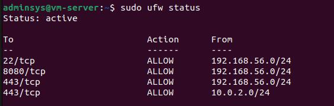 


---

### 1.8 Check ssh avant config sécurisé 

- Depuis mon hote :
```bash
ssh adminsys@192.168.56.2
```
- reussi -> Connexion SSh pour admin OK 

---

### 1.9 Configuration SSH Sécurisé
- 1. Save config inital de ssh
```bash
sudo cp /etc/ssh/sshd_config /etc/ssh/sshd_config.back
```

- 2. Modification config ssh
```bash
sudo nano /etc/ssh/sshd_config
``` 

- Puis on modifie pour authoriser le **port 22**
- Puis **desactivé** la connexion ssh en root
- et **Authorisé** l'utilisateur **adminsys**
- avec un **maximum** de test **authorisé** à **3** avant deconnexion 

```bash
Port 22
PermitRootLogin no
PasswordAuthentication yes  
PubkeyAuthentication yes
Protocol 2
MaxAuthTries 3
AllowUsers adminsys
```

On peut **redemarrer** le service et **check** le status
```bash
sudo systemctl restart ssh
sudo systemctl status ssh 
```

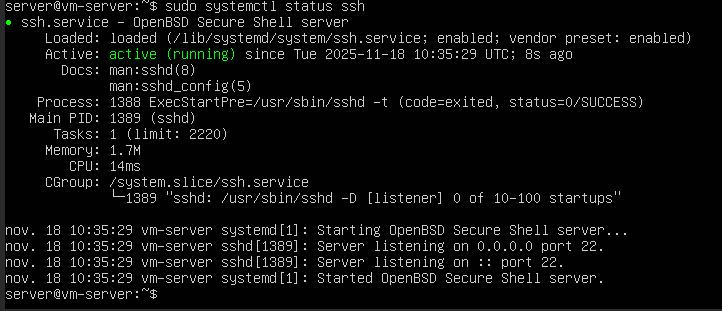 

Puis **re-tester** la connexion depuis l'hote vers le serveur
```bash
ssh adminsys@192.168.56.2
```

Connexion **reussi OK** 


---

### L'infrastructure web sur le Serveur `vm-server` est prete à etre installer et configurer

---
## Installation de la stack LAMP

Nous allons mainteant passer a l'installation et configuration du **serveur LAMP** 
- Linux
- Apache
- Mysql
- Php

---

### Installation Apache2

```bash
sudo apt install apache2 -y
```

Activer les modules Utiles : 
```bash
sudo a2enmod ssl rewrite headers proxy proxy_http
sudo systemctl restart apache2
sudo systemctl status apache2   ##Check le status
```

Caché la version d'Apache 
```bash
sudo nano /etc/apache2/apache2.conf
```
Puis ajouter a la fin pour passer le ServerToken en prod avec 

```bash
ServerTokens Prod
```

Puis relander le service Apache2

```bash
sudo systemctl restart apache2
sudo systemctl status apache2
```

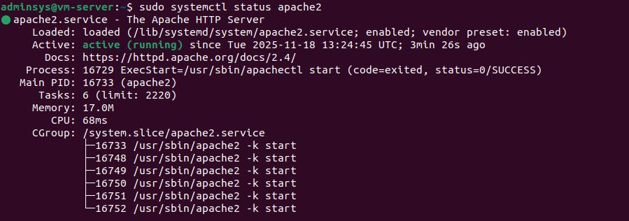 

---

### Installation MariaDB 

```bash 
sudo apt install mariadb-server mariadb-client -y 
```

Sécurisation : 
```bash
sudo mysql_secure_installation
```

- Set root password : yes
- Remove anonymous users : yes
- Disallow remote root login : yes
- Remove test DB : yes
- Reload privileges : yes

On a donc maintenant un mot de passe **root** pour **mariadb** 

---

### Installation PHP et extensions Wordpress

```bash
sudo apt install -y php php-fpm php-mysql php-xml php-mbstring php-curl php-gd php-zip php-intl php-imagick
```

On peut vérifier ( check la version ) 

```bash
php -v
```

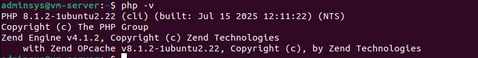 

---

### Préparation de la base MariaDB pour Wordpress

On va maintenant créer une base pour Wordpress, pour qui puisse stocker l'ensemble de donnée de notre site wordpress ( article, etc.. )


Pour ca il faut lancer Mysql avec le mot de passe renseigné dans la sécuristation juste avant :

```bash
sudo mariadb -u root -p
```

Mettre en place la structure pour Wordpress :

```bash
##Creation Nouvelle databases pour Wordpress
CREATE DATABASE wordpress_labs_2025;        

##Creation d'un nouvel utilisateurs ( pour wordpress )
CREATE USER 'wpadmin_labs2025'@'localhost' IDENTIFIED BY 'MotdePasseSecurise!123';

##Lui donné tous les droits pour l'administration
GRANT ALL PRIVILEGES ON wordpress.* TO 'wpadmin_labs2025'@'localhost';

##Recharger tous les droits ( relaod )
FLUSH PRIVILEGES;

##Pour sortir de mysql
EXIT;
```

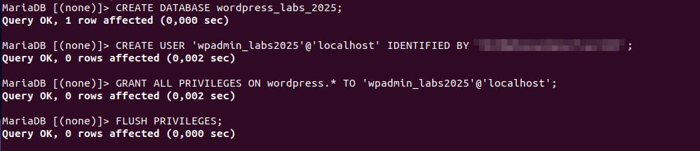 

On a donc maintenant une nouvelle **DATABASE** avec le nom `wordpress_labs_2025` 

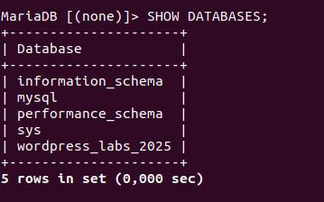 

Ainsi qu'un nouvel **utilisateur** `wpadmin_labs2025` dans la **table** `user` de la **DATABASE** de `mysql` qui servira pour **administrer** la base de donnée de **wordpress_labs_2025** une fois lié au service **wordpress**

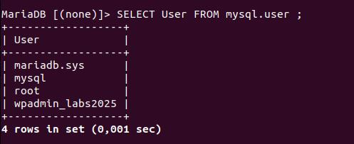 


On peut également vérifier que l'utilisateur `wpadmin_labs2025` à bien les droits sur la base de donnée `wordpress_labs_2025`
Nous avons maintenant une base de donnée **prete** pour **wordpress**

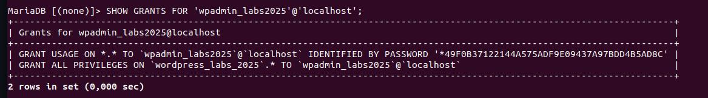 

A noter qu'il est **important** de **mémoriser** ces informations :
- Nom de base de donnée
- User avec tous les droits
- Mot de passe de l'user

Pour **synchroniser** la base de donnée à **wordPress** lors de l'instalation de Wordpress.

---

### Télécharger Wordpress

On va mainteant pouvoir télécharger Wordpress qui sera le coeur de notre site web


**Arborescence du Site :**
- le **repertoire** de notre site `wordpress` sera dans `/var/www/`

Ce qui nous donnera `/var/www/wordpress/` avec le contenu du site

1. On va **créer** le répertoire wordpress 

*A noter : qu'il faudra qu'on modifie le répertoire root de notre site*

```bash 
sudo mkdir -p /var/www/wordpress
```

2. On va maintenant ce **placer** dans le répertoire `/tmp/` pour télécharger wordpress 
```bash
cd /tmp
wget https://wordpress.org/latest.tar.gz
```

3. On va ensuite pouvour **décompresser** le fichier .tar 

```bash
tar -xvf latest.tar.gz
```
*Note : une fois décompresser le fichier sera nommé `wordpress`*

4. On peut donc **déplacer** le contenu de notre repertoire latest dans wordpress avec

```bash
sudo mv wordpress/* /var/www/wordpress/
```

5. Puis on va s'assurer qu'**Apache** a les **permissions** sur le dossier `wordpress`

```bash
sudo chown -R www-dat:www-data /var/www/wordpress
sudo chmod -R 755 /var/www/wordpress
``` 
6. On peut donc maintenant **vérifier** notre répertoire `wordpress/`

```bash
ls -lrta /var/www/wordpress
```

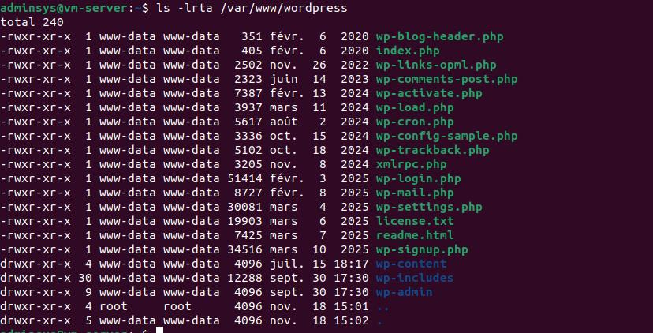 

On a donc mainteant notre site wordpress de télécharger qui est maintenant pret pour la configuration Apache ( VirtualHost )

L'installation de stack **LAMP** + **wordpress** est maintenant effective
- [X] Installation Apache2
- [X] Installation Mariadb
- [X] Installation PHP 
- [X] Téléchargement site wordpress

---

## Configuration du VirtualHost Apache

On va maintenant pouvoir configurer **VirtualHost** Apache pour Wordpress

Pour objectif : 
- de servir Wordpress via Apache ( backend )
- Dans `/var/www/wordpress`
- En prevision du reverse proxy **NGINX**

**Nginx** sera monté en **reverse** **Proxy** donc devant Apache afin de ne pas exposer directement Apache.

**Nginx** servira donc les **requettes** en **local** pour **Apache** sur le port `8080` car le port `80` servira NGINX

La configuration de notre serveur web d'Apache se fera dans le répertoire `/etc/apache2/`

Rappels Dossier de Configuration : `/etc/apache2/`

```bash
./etc/apache2/                ## Répertoire de Configuration Apache
├── sites-available/            ## Configuration des Vhosts de nos sites
│   └── wordpress.conf               # Vhost wordpress
├── sites-enabled/              ## -- Sites Actifs
│
├── mods-available/             ## Configuration des Modules
├── mods-enabled/               ## -- Modules Actifs
│
├── ssl/                        ## Configuration de nos SSL ( si besoin )
│
├── conf-available/             ## Configuration 
│   └── security.conf            
├── conf-enable/                ## -- Configuration actifs
│ 
├── apache2.conf               ## Configuration global d'apache2   
└── ports.conf                  ## Fichier Configuration des ports 
```

On va donc pouvoir créer un fichier de **configuration** `wordpress.conf` dans le répertoire :
- `sites-available/`

```bash
sudo nano /etc/apache2/sites-available/wordpress.conf
```

Puis notre configuration de base de la VirtualHost :

```bash
<VirtualHost *:8080>
    ServerName intranet.novatech
    ServerAdmin admin@localdomain

    ##Repertoire root
    DocumentRoot /var/www/wordpress     

    ##Config directory /wordpress
    <Directory /var/www/wordpress>
        Options FollowSymLinks
        AllowOverride All
        Require all granted
    </Directory>

    ##Nos fichier log 
    ErrorLog  /var/log/apache2/wordpress_error.log
    CustomLog /var/log/apache2/wordpress_access.log combined
</VirtualHost>
```

Donc plus tard NGINX servira les requettes vers `:8080`

Puis on va activé le VirtualHost avec le module `a2`
qui permettra de faire un lien symbolique de `site-available` à `site-enabled` de notre fichier de configration et donc d'activé notre site

```bash
sudo a2ensite wordpress.conf
```

On a besoin d'activer le module d'apache `rewrite` pour les **permaliens** ( *deja fait* )

```bash
sudo a2enmod rewrite
```

Puis mainteant on a besoin de stipuler à Apache d'écouter sur le port `8080` , on va donc editer le fichier `/ports.conf`

```bash
sudo nano /etc/apache2/ports.conf
```
Et rajouter la ligne : 

```bash
Listen 127.0.0.1:8080          ##Pour Nginx
Listen 192.168.56.2:8080       ##Pour administrer via l'hote
```

On va pouvoir tester la configuration Apache avec : 

```bash 
sudo apache2ctl configtest
```

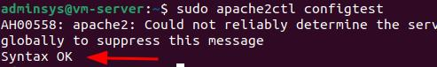

La syntax étant ok, on peut donc **restart** 

```bash
sudo systemctl restart apache2
```

On peut également tester les ports ouvert et vérifier les ports d'écoute d'apache avec la commande : 

```bash
sudo ss -tlnp | grep 8080 
```
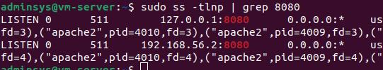

On va maintenant pouvoir tester via la console que le site est maintant accessible avec `curl`
```bash
curl -v http://127.0.0.1:8080/
```

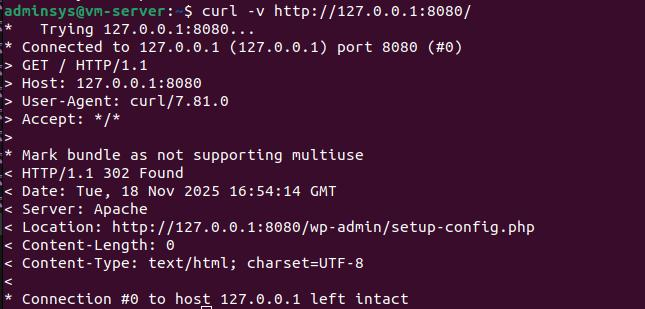

Notre **connexion** est bien **établie**, On va mainteant pouvoir **continuer** l'installation de wordpress depuis un **navigateur** par exemple. 

---

## Installation de Wordpress 

On peut donc mainteant grace au réseaux Host-Only qui simule notre vlan d'Administration via `192.168.56.0/24` et également le pare-feu (ufw) qui autorise le vlan Admin sur le port 8080 :

- Lancé depuis un navigateur de la machine Hote pour installer wordpress

```bash
http://192.168.56.2:8080
```

Et Poursuivre l'installation avec les champs 

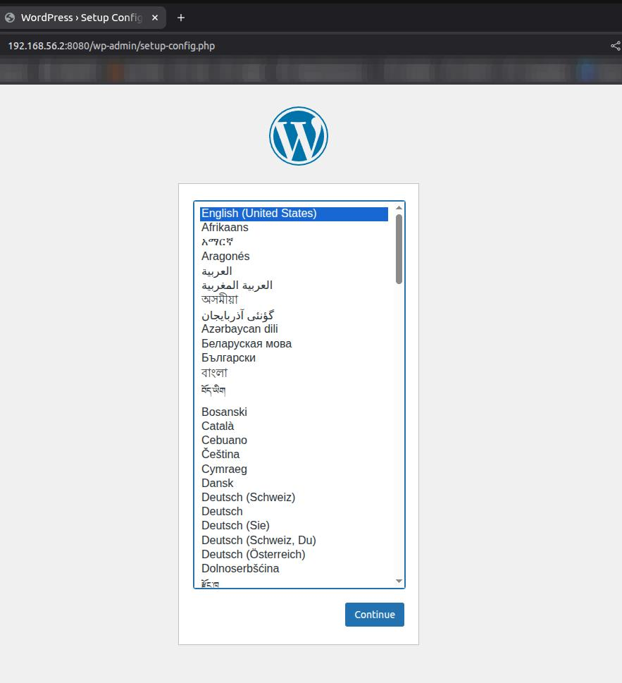

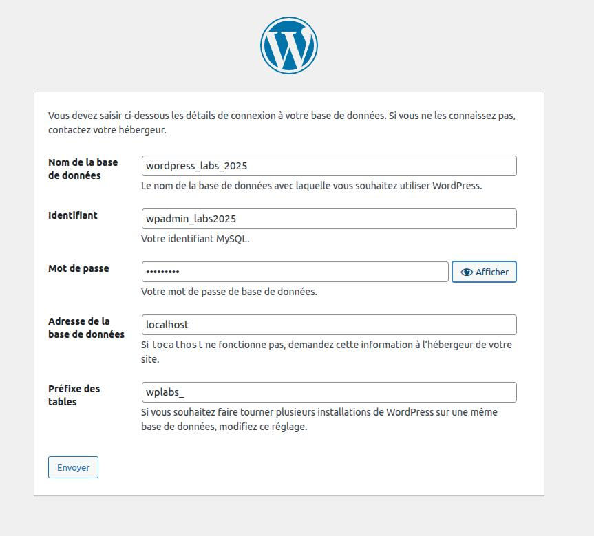

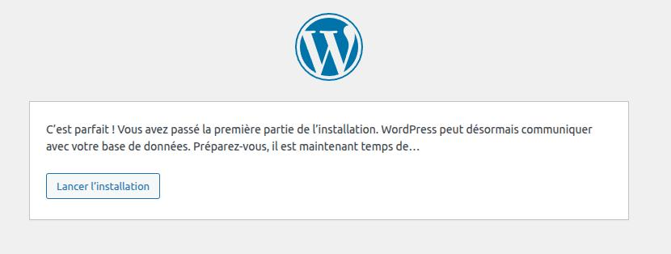

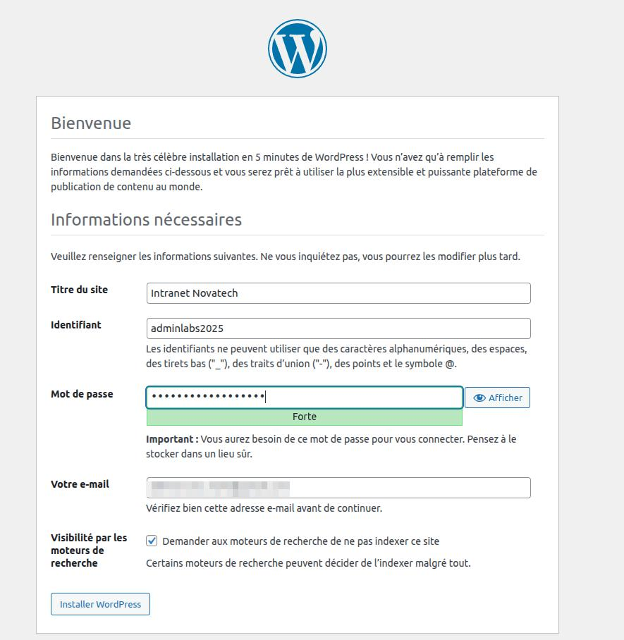

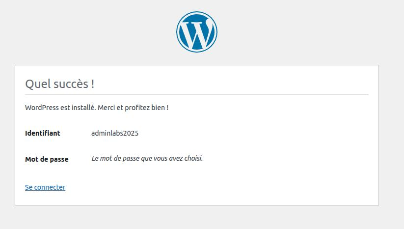

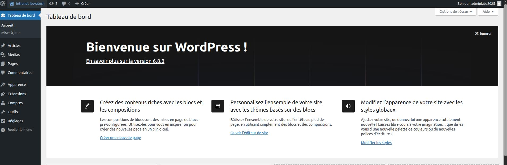

---

**Installation de WordPress Réussi**

---

Nous allons mainteant faire quelques mesure de **sécurité** établi par les **recommandations** WordPress 

1. Supprimer le fichier **wp-config-sample.php**

Fichier de template des config

```bash
sudo rm -rf /var/www/wordpress/wp-config-sample.php
```

Puis sur le fichier `wp-config.php` , qui expose notre base de donnée, utilisateurs mariadb et mot de passe

Necessite des droits spécifique, ici en **400** ( lecture seul )

```bash
sudo chmod -R 400 /var/www/wordpress/wp-config.php
```

On a donc mainteant WordPress d'installé sur notre serveur, pour l'instant accessible depuis le port `8080` avant l'arrivé de NGINX

---

## Installation et Configuration de LDAP

Nous allons pouvoir maintenant installé et configurer notre annuaire LDAP avec les employés de l'entreprise qui centralisera par la suite les connexions sur l'intranet de Novatech

Une fois LDAP de configuré, nous devrons installé un plugin sur wordpress pour synchronisé l'ensemble des connexions avec l'annuaire LDAP de l'entreprise. 

Configuration LDAP : 
- **Admin LDAP** : admin_novatech
- **Domaine**: novatech.local
- **Organisation** : NovaTech
- **Mot de passe** Admin : ***
- **Base DN** : dc=novatech,dc=local


```bash
##Installation
sudo apt update 
sudo apt install slapd ldap-utils -y

##Si besoin de Reconfigurer LDAP
sudo dpkg-reconfigure slapd
```

On peut donc checker l'entré racine de l'annuaire avec : 

```bash
ldapsearch -x -LLL -H ldap://localhost -b dc=novatech,dc=local
```


Notre racine LDAP est mainteant créé, on pouvoir lui rajouter des groupes et des employés : 

Liste employés pour le labs : 
- **Jean Dupont** - employees
- **Marie Lefevre** - Manager 

Ici les Groupes serons donc `employees` et `managers`

et les utilisateurs `mlefevre` & `jdupont`

On va créer un dossier où l'ensemble de la configuration LDAP sera mit en place 

```bash
mkdir -p ~/ldap_lab
```

Puis l'intérieur de répertoire les fichiers de Condiguration pour : 
- les **utilisateurs**
- les **groupes**

Puis stipuler à LDAP où sont les fichiers pour les `user` et `groups`


Ce qui nous donnera une architecture : 

```bash
./ldap_lab               ## Répertoire de Configuration ldap
├── base.ldif            ## conf de base qui va lié uers & groups
├── users.ldif           ## conf pour les users 
└── groups.ldif          ## conf pour les groups  
```

---

1. Création du fichier des **Bases**

```bash 
nano base.ldif
```

```bash
dn: ou=People,dc=novatech,dc=local
objectClass: organizationalUnit
ou: People

dn: ou=Groups,dc=novatech,dc=local
objectClass: organizationalUnit
ou: Groups
```

puis **appliqué** le fichier **base** 

```bash
sudo ldapadd -x -D cn=admin,dc=novatech,dc=local -W -f ~/ldap_lab/base.ldif
```

---

2. Création du fichier des **Utilisateurs** 

```bash 
nano users.ldif
```

```bash
dn: uid=jdupont,ou=People,dc=novatech,dc=local
objectClass: inetOrgPerson
cn: Jean Dupont
sn: Dupont
uid: jdupont
userPassword: test123

dn: uid=mlefevre,ou=People,dc=novatech,dc=local
objectClass: inetOrgPerson
cn: Marie Lefevre
sn: Lefevre
uid: mlefevre
userPassword: test123
```

Ensuite Appliqué la configuration `users.ldif` à LDAP ( needs password LDAP Admin )

```bash
# Ajouter les utilisateurs
sudo ldapadd -x -D cn=admin,dc=novatech,dc=local -W -f ~/ldap_lab/users.ldif
```

---

3. Création du fichier des **groupes**

```bash 
nano groups.ldif
```

```bash 
dn: cn=employees,ou=Groups,dc=novatech,dc=local
objectClass: groupOfUniqueNames
cn: employees
uniqueMember: uid=jdupont,ou=People,dc=novatech,dc=local
uniqueMember: uid=mlefevre,ou=People,dc=novatech,dc=local

dn: cn=managers,ou=Groups,dc=novatech,dc=local
objectClass: groupOfUniqueNames
cn: managers
uniqueMember: uid=jdupont,ou=People,dc=novatech,dc=local

```

Ensuite Appliqué la configuration `groups.ldif` à LDAP ( needs password LDAP Admin )

```bash
# Ajouter les groupes
sudo ldapadd -x -D cn=admin,dc=novatech,dc=local -W -f ~/ldap_lab/groups.ldif
```

---

4. Ensuite on peut vérifier les nouvelles entré de notre annuaire 

```bash
ldapsearch -x -LLL -b dc=novatech,dc=local
```


On a donc notre annuaire LDAP de mis en place, nous allons pouvoir installé le plugin qui va lié LDAP à WordPress 

---

## Lié LDAP à WordPress

Pour lié notre annuaire à WordPress, on va installé le Plugin/Extension "LDAP/Activre Directory Login for Intranet"

Donc on se rend sur la l'interface d'administration de notre WordPress puis on va installé et activé l'installation. 

On va ensuite dans les réglges de l'extension LDAP Login, puis on va configurer le Plugin. On remplie en suivant les étapes.


On a mainteant une connexion sur notre site intranet.novatech grace a l'annuaire LDAP 

Afin de tester une infrastructure professionnel, et eviter de tomber sur la page wp-admin, on va installer une page de login pour tester rapidement avec le plugin `Theme My Login`


On va également faire quelques modif sur le thème et personnalisation sur notre site pour que ce soit plus agréable

Notre super beau site : `http://192.168.56.2:8080`


Ainsi que la page de **Login** soit directement accessible via notre **super bouton Connexion** : 

( ou sinon `http:/192.168.56.2:8080/login`)


Puis ensuite notre **super** espace de page d'acceuil de nos utilisateurs de l'**intranet de Nanotech**: 


**Bonjour Mr Jdupont !**


On a donc mainteant un **serveur LAMP wordpress** gérer par l'**acces** de notre **annuaire LDAP** 

On va pouvoir passer a la prochaine étape d'**installer** et de **configurer** **NGINX** devant Apache et avoir du **https** avec certificat TLS

---

## Génération du Certificat TLS 

Avant d'installer et de configurer NGINX
Nous allons générer le certificat pour HTTPS avec `openssl` ( *deja installé*)

```bash
sudo apt insatll openssl 
```
--

1. Rajouter un répertoire `novatech` où les certificats seront stockés

```bash
sudo mkdir -p /etc/ssl/novatech
sudo chmod 700 /etc/ssl/novatech    ##Attribuer permission
``` 


---

2. Ensuite on va générer la clé privée en 2048 bits

```bash
sudo openssl genrsa -out /etc/ssl/novatech/intranet.key 2048
```

C'est la clé privé - secrete 

On doit donc également attribué une permission restrictive 

```bash
sudo chmod 600 /etc/ssl/novatech/intranet.key
```

---

3. On va mainteant générer le CSR ( Certificate Signing Request )

C'est la demande de certificat, comme ici il sera auto-signé
ce sera ce fichier de demande - request qu'il faudra transmettre à une authorité si besoin.

OpenSSL a besoin d'information sur notre organisation, nous allons établir des informations pour le labs purement fictif : 

| Question                | Valeur                                    |
| ----------------------- | --------------------------------------------------- |
| **Country Name**        | FR                                                  |
| **State**               | Ile-de-France                                       |
| **Locality**            | Paris                                               |
| **Organization Name**   | NovaTech                                            |
| **Organizational Unit** | IT                                                  |
| **Common Name**         | intranet.novatech.local        |
| **Email**               | admin@novatech.local

Notre domaine sera donc : `intranet.novatech.local`

On va donc pouvoir obtenir le CSR grace la Key générer juste avant : 

```bash
sudo openssl req -new -key /etc/ssl/novatech/intranet.key -out /etc/ssl/novatech/intranet.csr
```

---

4. Génerer le Certificat Auto-Signé

Nous avons maintenant tous les élements, la `Key` & le `CSR `( la demande de requet )
pour **générer** le **Certificat** en Auto-Signé ici

```bash
sudo openssl x509 -req -days 365 -in /etc/ssl/novatech/intranet.csr \
  -signkey /etc/ssl/novatech/intranet.key \
  -out /etc/ssl/novatech/intranet.crt
```

On a donc mainteant un certifcat Auto-Signé pour notre intranet Novatech ici : `/etc/ssl/novatech/intranet.crt`

---

## Installation & Configuration NGINX 

Nous allons pouvoir installer et configurer Nginx 

Rappels : 
- **Nginx** sera **devant** Apache ( qui lui sera en backend sur le port `8080` )
- **Nginx** sera sur le port `80` pour le **HTTP** et redigera sur le port `443` pour le **HTTPS** ( avec notre certificat TLS )
- Puis **Nginx** transmettra les requêtes en **local** vers Apache donc vers `127.0.0.1:8080`

---

1. Installer Nginx 

```bash
sudo apt update
sudo apt install nginx -y
```

Checker qu'il fonctionne ( running )
```bash
sudo systemctl status nginx
```

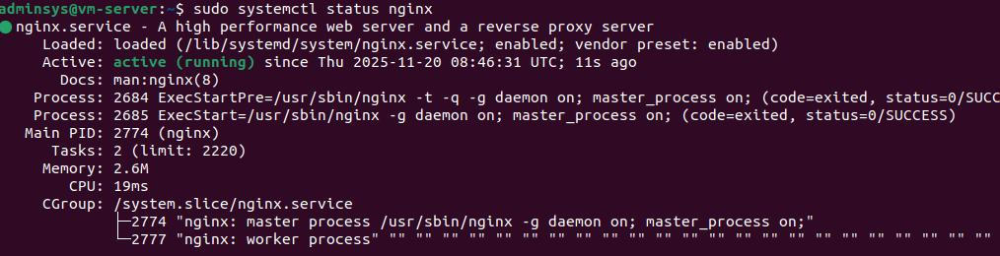

On a donc une architecture qui est similaire dans les repertoires a la logique d'Apache 
- avec `sites-availables`  et `sites-enabled` 
- et `modules-availables` et `modules-enabled`

dans `/etc/nginx/`

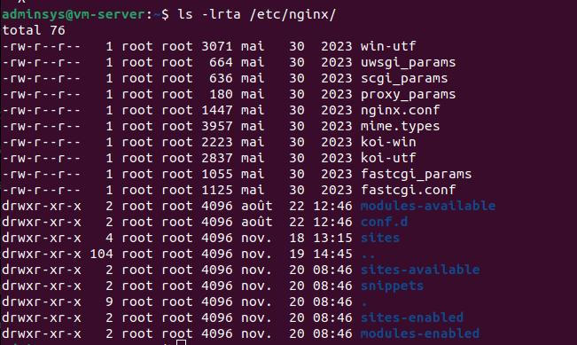

---

2. Nous allons donc pouvoir configurer notre site 

En placant le fichier de configuration dans `sites-availables`

```bash
sudo nano /etc/nginx/sites-available/intranet.novatech.local
```

puis remplir avec : 

```bash
## Sur le port 80 ( HTTP )
server {
    listen 80;
    server_name intranet.novatech.local;

    # Redirection HTTP -> HTTPS
    return 301 https://$host$request_uri;
}

## sur le port 443 ( HTTPS )
server {
    listen 443 ssl;
    server_name intranet.novatech.local;

    ## Notre Certificat & notre Key
    ssl_certificate /etc/ssl/novatech/intranet.crt;
    ssl_certificate_key /etc/ssl/novatech/intranet.key;

    ssl_protocols TLSv1.2 TLSv1.3;
    ssl_prefer_server_ciphers on; 
    ssl_ciphers HIGH:!aNULL:!MD5;

    ## Les Basic Header de Sécurité
    add_header X-Frame-Options "DENY" always;
    add_header X-Content-Type-Options "nosniff" always;
    add_header Referrer-Policy "no-referrer-when-downgrade" always;
    add_header X-XSS-Protection "1; mode=block" always;

    ## Notre dossier root du site de Novatech
    root /var/www/wordpress;
    index index.php index.html index.htm;

    # Reverse proxy vers Apache en local sur le port 8080
    location / {
        proxy_pass http://127.0.0.1:8080;
        ## Les header de sécurité 
        proxy_set_header Host $host;
        proxy_set_header X-Real-IP $remote_addr;
        proxy_set_header X-Forwarded-For $proxy_add_x_forwarded_for;
        proxy_set_header X-Forwarded-Proto $scheme;
        proxy_set_header X-Forwarded-Host $host;
        proxy_http_version 1.1;
        proxy_set_header Connection "";
        proxy_buffering off;
    }

    # On autorise l'acces wp-admin seulement pour la canal admin
    location /wp-admin {
        allow 192.168.56.0/24;    # admin host-only
        deny all;
        proxy_pass http://127.0.0.1:8080;
        ## Les header de sécurité 
        proxy_set_header Host $host;
        proxy_set_header X-Forwarded-Proto $scheme;
        proxy_set_header X-Real-IP $remote_addr;
    }


    # PHP handling (pas strict nécessaire, Apache gère)
    location ~ \.php$ {
        proxy_pass http://127.0.0.1:8080;
        ## Les header de sécurité 
        proxy_set_header Host $host;
        proxy_set_header X-Forwarded-For $proxy_add_x_forwarded_for;
        proxy_set_header X-Forwarded-Proto $scheme;
    }

    # Bloquer l’accès direct à certains fichiers sensibles
    location ~* /(\.ht|wp-config\.php|readme\.html) {
        deny all;
    }
}

```

---

3. Il faut mainteant activer le site

En faisant le lien symbolique de `sites-availables` vers `sites-enabled` ( qui était fait par le module a2 sur apache )

```bash
sudo ln -s /etc/nginx/sites-available/intranet.novatech.local /etc/nginx/sites-enabled/
sudo nginx -t                 ##CHECK et vérifie la SYNTAX
sudo systemctl reload nginx   ##Reload
```


La Syntaxe et la configuration test sont ok et successfull

---

4. Ajuster WordpPress pour qu'il reconnaisse le HTTPS derrière le Proxy

**Recommandation Nginx - WordPress**

Ajouter dans `wp-config.php` :

```bash
// If behind a reverse proxy (NGINX) that terminates SSL, ensure WP knows requests are HTTPS
if (isset($_SERVER['HTTP_X_FORWARDED_PROTO']) && $_SERVER['HTTP_X_FORWARDED_PROTO'] === 'https') {
    $_SERVER['HTTPS'] = 'on';
}
// Force SSL for admin pages (optional but recommended)
define('FORCE_SSL_ADMIN', true);

// Ensure correct site URL (update if necessary)
define('WP_HOME', 'https://intranet.novatech.local');
define('WP_SITEURL', 'https://intranet.novatech.local');
```

---

5. Test de notre infrastructure web Nginx + Apache2 + LDAP

Test rapide depuis notre serveur 

```bash
curl -v -k https://192.168.56.2/    ##Sur l'interface réseau privé  admin  
curl -v -k https://10.0.2.4/        ##Sur l'interface réseau simulé entreprise
```

A noté qu'il est important de vérifier les écoutes de Nginx et d'Apache pour qu'il n'y ai pas de conflit entre les deux. 

On doit s'assurer que le port 443 est écouté par Nginx : 

```bash
sudo ss -tlnp | grep ':443\b' || sudo lsof -i :443
```

Si apache écoute sur le 443, vérification et suppression des ports 443 dans le `/etc/apache2/ports.conf`

Si Nginx n'apparait pas, vérifier le site par défault est bien supprimé ou dans la virtualhost la mentions du port d'écoute `443`

Test effectué en local sur le serveur sur les deux interfaces : Succes

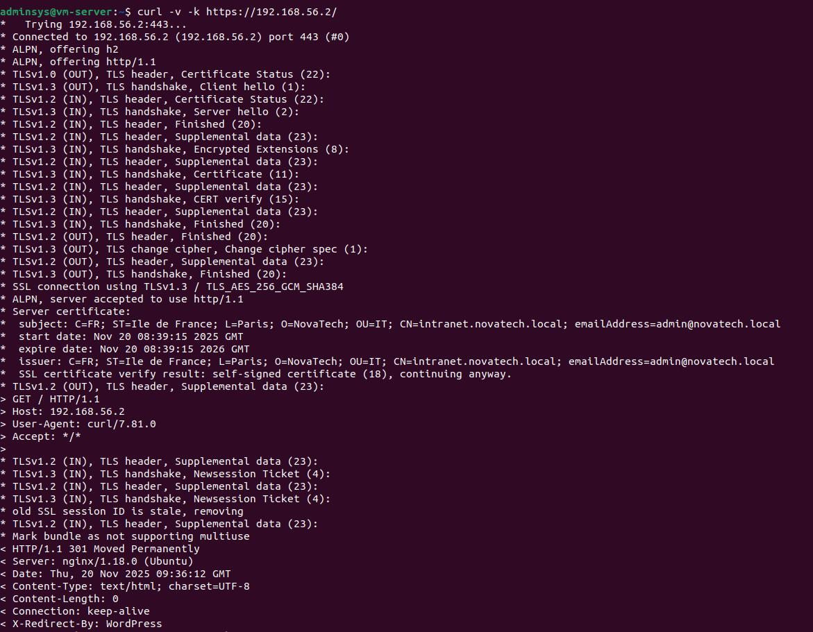

On peut donc allé vérifier dans les `/log/nginx/acces.log`
que notre connexion remonte bien

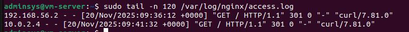

Nos log remonté bien notre test d'acces sur les deux interfaces réseaux

On peut donc mainteant tester sur notre VM et Hote l'acces a notre  site 

Pour vérifier que : 
- Admin est toujours acces a son interface d'administration
- Et que Jdupont puisse également se conneceter 
- Puis Vérifier également les logs d'acces après les test sur les machines

---

## Test Hote 

Test réalisé sur notre Hote qui simule le vlan administration sur la patte réseau `192.168.56.0/24`

Donc test réalisé :

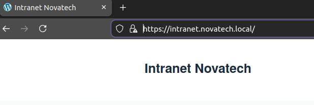
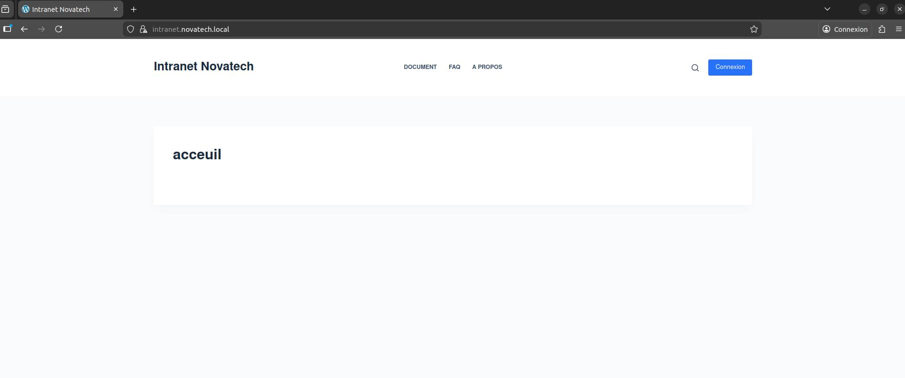

On a donc une Connexion réussi sur la patte réseau administartion

Vérifier le certificats TLS : 

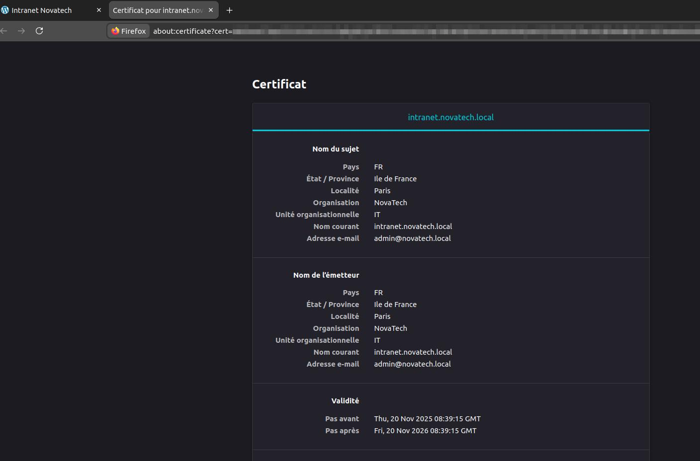

Puis l'acces à l'admin sur page Administration `wp-admin`

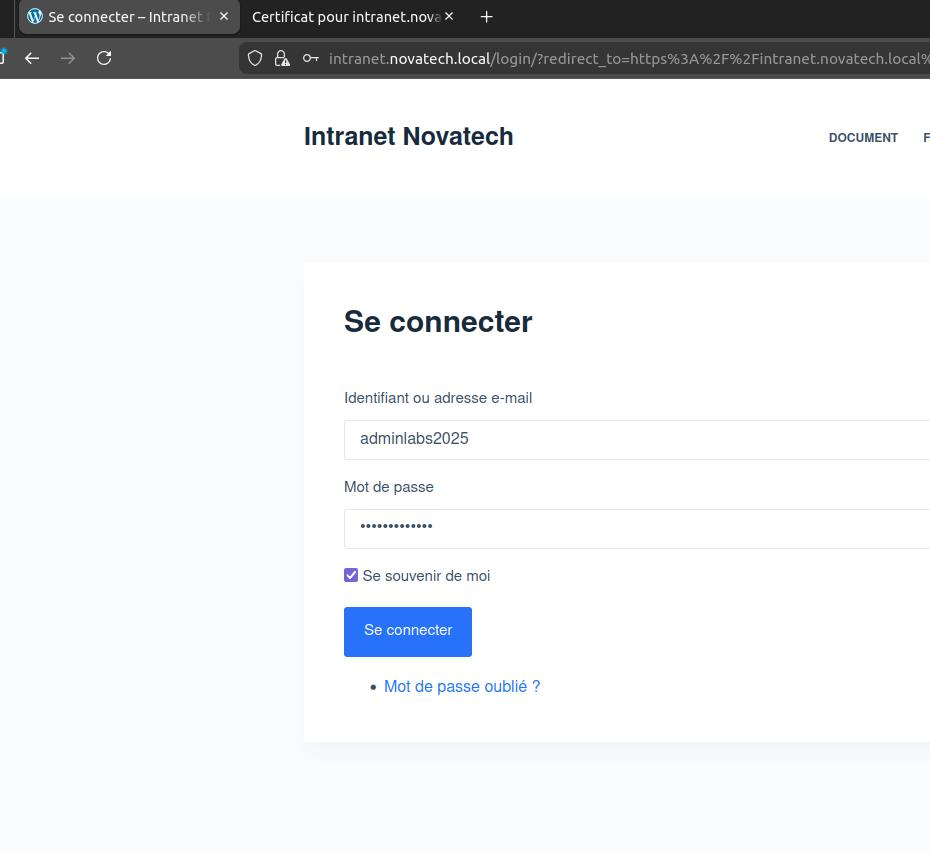

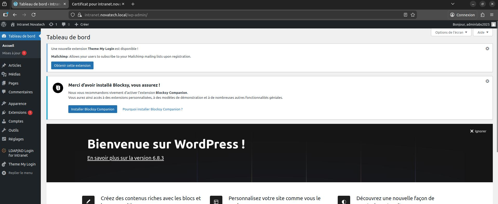

Vérifions la remonté des log acces :

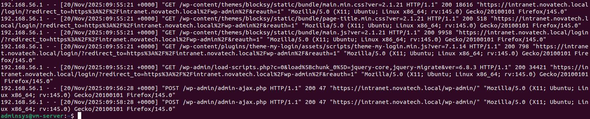

On a également bien les logs d'acces qui remonte avec l'ip de notre hote simulé de notre réseau administration `192.168.56.1`, et ici notre acces à la page `wp-admin` par exemple

---

## Test sur la vm-entreprise de Mr Jdupont

On peut donc également tester sur notre réseau d'enterprise simulé sur la patte réseau `10.0.2.0/24` avec comme ip de la vm-entreprise `10.0.2.15`

Depuis notre vm-entreprise 


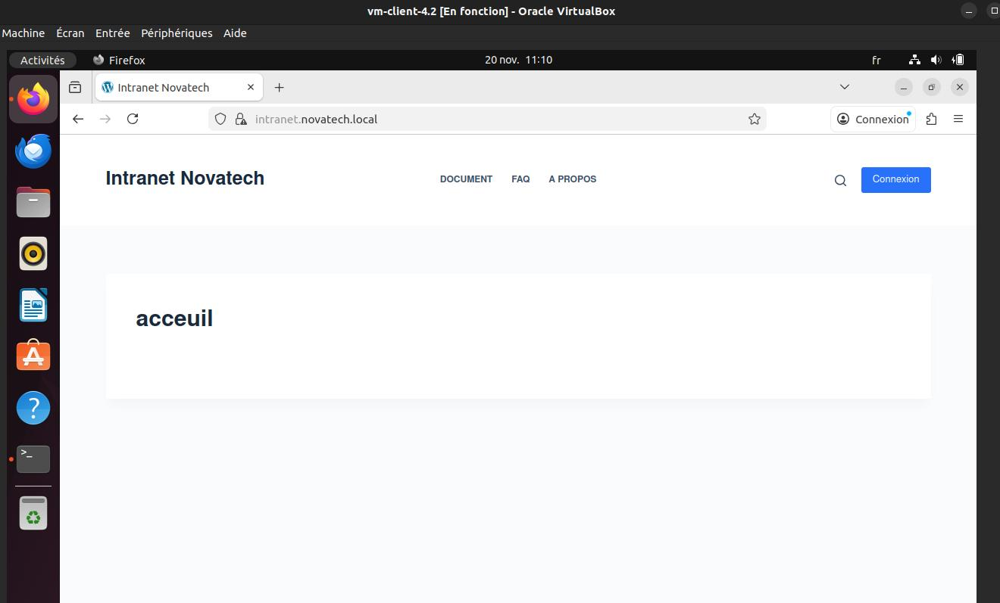

On a donc une connexion réussi vers notre site intranet.novatech.local

On peut donc allé vérifier notre certificat 

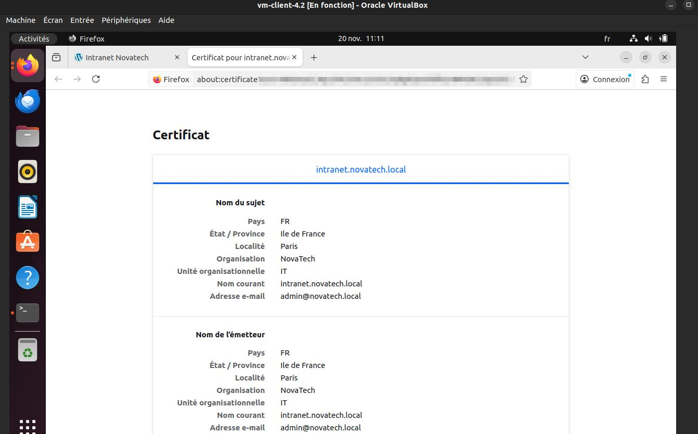

Puis tester un connexion sur la page login avec le bouton connexion 

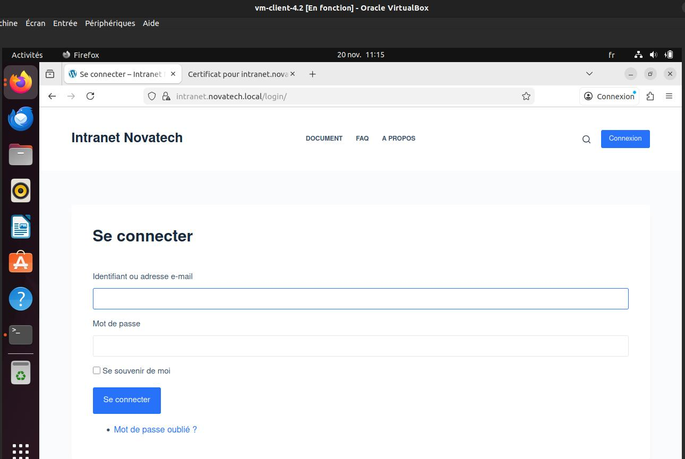

**Bonjour Mr Jdupont !**
On a donc un connexion reussi via notre annuaire LDAP 

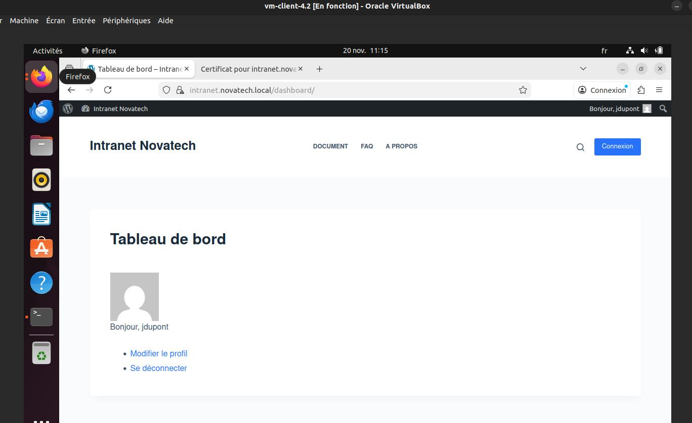

Puis on peut tester l'acces refuser à la page `wp-admin` qui est strictement accessible via notre ip d'administration

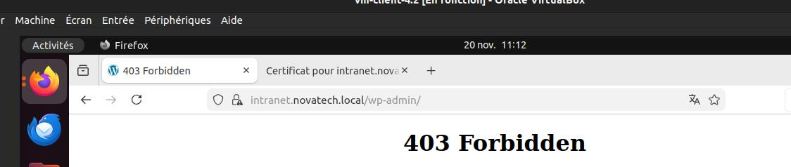


On peut donc allé vérifier la remonté des logs sur notre serveur : 

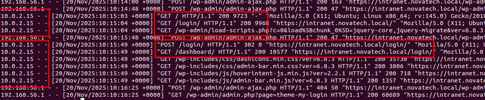

Les logs d'acces remonte bien également 

**On a donc mainteant notre infrastrucure web via notre serveur LAMP + WorPress + avec NGINX en Reverse-Proxy et notre Annuaire LDAP de configuré et opérationnel**

---

## Durcicement de sécurité avec Fail2ban

Afin de durcir la sécurité sur notre infrastructure, nous allons installer et configuré `Fail2ban` qui détectera en fonction de la configuration le maximum de tentative de connexion pour ban l'IP.

```bash
sudo apt install fail2ban -y
```

On va ensuite créer un filtre pour proteger notre `/wp-login.php`

```bash
sudo nano 
/etc/fail2ban/filter.d/wordpress.conf
```

```bash
[Definition]
failregex = ^<HOST> -.*"(POST|GET) /wp-login.php
ignoreregex =
```
Puis créer la Jail de Fail2ban :

```bash
sudo nano /etc/fail2ban/jail.d/wordpress.local
```

```bash
[wordpress]
enabled = true
filter = wordpress
action = iptables-multiport[name=wordpress, port="http,https"]
logpath = /var/log/nginx/*access.log
maxretry = 5
findtime = 600
bantime = 3600
```

Puis redémarer et vérifier le status actif

```bash
sudo systemctl restart fail2ban
sudo fail2ban-client status wordpress
```
On a  donc maintant une protection avec fail2ban vs les ddos simple mais on pourrai bien évidemment allé plus loins dans la mise en sécurité de notre infrastructure web avec Crowdsec, etc. comme dans mon projet n°4. 

---

## Conclusion du projet 

Ce projet m'a permis de mettre en place une **architecture complète**, **robuste** et **sécurisée** pour un environnement **Intranet d’entreprise** basé sur **WordPress**.
Il combine les bonnes pratiques d’administration système, de sécurisation réseau, et de conception d’infrastructure web moderne.

Grâce à la mise en place d’un **reverse proxy Nginx** en frontal, associé à un **serveur Apache** hébergeant **WordPress**, l’architecture bénéficie à la fois :
- d’une meilleure performance,
- d’une isolation logique,
- d’une capacité d’évolution bien plus propre que dans une installation monolithique.

Le site est désormais intégralement servi en **HTTPS**, grâce à un **certificat TLS** généré et configuré manuellement.
Les accès sensibles, notamment l’espace `/wp-admin`, sont protégés via des **restrictions réseau** et des **en-têtes HTTP renforcés**.

L’ajout de fonctionnalités utilisateur avec Theme My Login a permis d’offrir une interface adaptée aux employés, séparée du back-office WordPress habituel, améliorant l’expérience tout en renforçant la sécurité.

Je vous remercie d'avoir prit le temps de lire et de découvrir mon projet. 

---
## Licence
Ce projet est sous licence **Creative Commons Attribution-NonCommercial 4.0 International (CC BY-NC 4.0)**.
Toute utilisation commerciale est strictement interdite sans autorisation préalable. Consultez le fichier [LICENSE](./LICENSE) pour plus de détails.

---
**Alexis alias Faramir!**  
